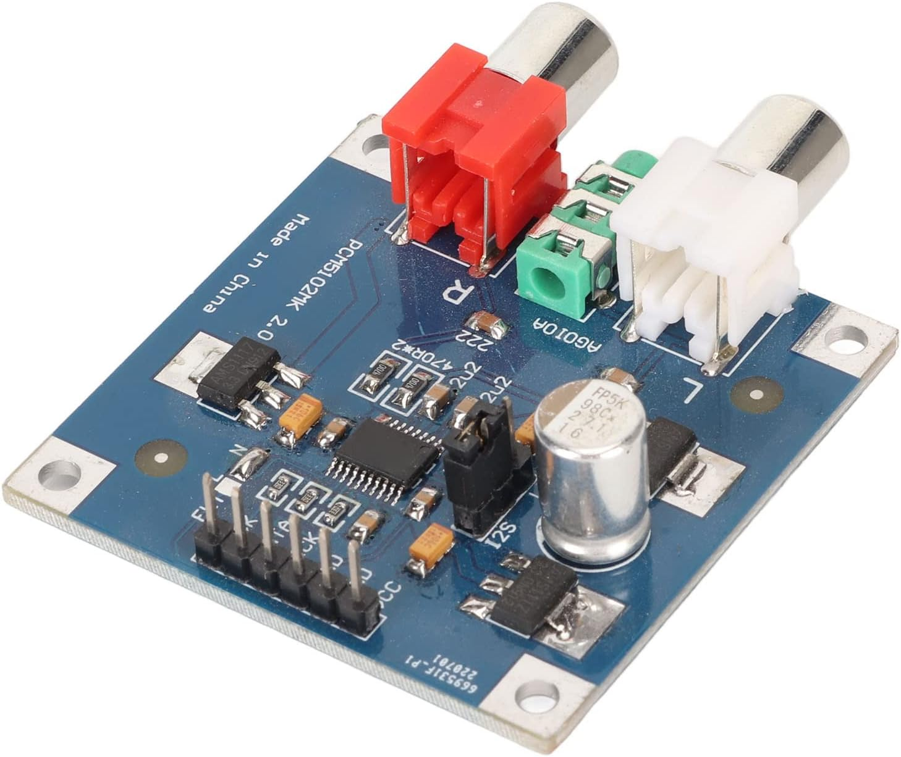
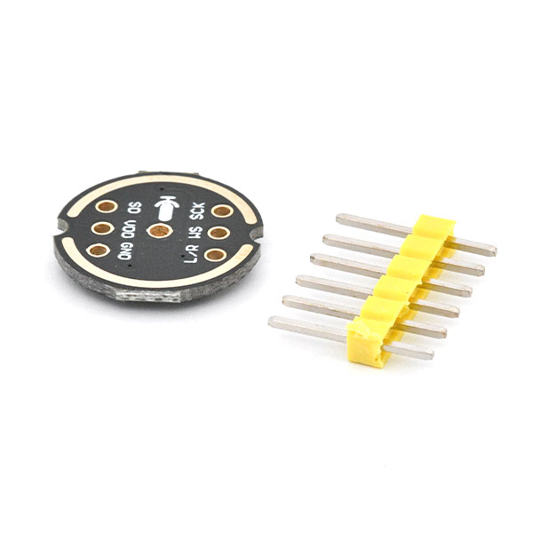

| Supported Targets | ESP32 |
| ----------------- | ----- |

# Hands-Free Client

This is a heavily edited copy of the standard [ESP IDF hfp-hf example](https://github.com/espressif/esp-idf/tree/v5.5.1/examples/bluetooth/bluedroid/classic_bt/hfp_hf).
It uses the latest [HFP Client API](https://docs.espressif.com/projects/esp-idf/en/stable/esp32/api-reference/bluetooth/esp_hf_client.html) which leaves the mSBC encoding/decoding to the program.
In fact, it actually works - inputting and outputting real audio.

## How to use example

### Hardware Required

This example is designed to run on commonly available ESP32 development board, e.g. ESP32-DevKitC. To operate it should be connected to an AG running on a smartphone or on another ESP32 development board loaded with Hands Free Audio Gateway (hfp_ag) example from ESP-IDF.
You'll need a I2S DAC to output sound to your speakers.

Furthermore you'll need to connect a INMP441 MEMS microphone (L/R to ground for left audio input). These are pretty cheap high quality I2S microphones.


### Configure the project

All needed configs have already been set (hardcoded) in sdkconfig.defaults.
To get things running you should be able to just Build and Flash. (you'll need to wire your mic and dac according to the provided settings)
If you wish to wire your mic and dac to other pins, just make sure you set your correct pin config in main.

### Build and Flash

Build the project and flash it to the board, then run monitor tool to view serial output:

```
idf.py -p PORT flash monitor
```

(Replace PORT with the name of the serial port to use.)

(To exit the serial monitor, type ``Ctrl-]``.)

See the [Getting Started Guide](https://docs.espressif.com/projects/esp-idf/en/latest/get-started/index.html) for full steps to configure and use ESP-IDF to build projects.

## Example Output

When you run this example, the explain prints the following at the very beginning:

```
Type 'help' to get the list of commands.
Use UP/DOWN arrows to navigate through command history.
Press TAB when typing command name to auto-complete.

 ==================================================
 |       Steps to test hfp_hf                     |
 |                                                |
 |  1. Print 'help' to gain overview of commands  |
 |  2. Setup a service level connection           |
 |  3. Run hfp_hf to test                         |
 |                                                |
 =================================================

```

### Service Level Connection and Disconnection

You can type `con` to establish a service level connection with AG device and log prints such as:

```
connect
W (79632) BT_APPL: new conn_srvc id:27, app_id:1
I (79642) BT_HF: APP HFP event: CONNECTION_STATE_EVT
I (79642) BT_HF: --connection state connected, peer feats 0x0, chld_feats 0x0
I (79792) BT_HF: APP HFP event: CALL_IND_EVT
I (79792) BT_HF: --Call indicator NO call in progress
I (79792) BT_HF: APP HFP event: CALL_SETUP_IND_EVT
I (79802) BT_HF: --Call setup indicator NONE
I (79802) BT_HF: APP HFP event: NETWORK_STATE_EVT
I (79812) BT_HF: --NETWORK STATE available
I (79812) BT_HF: APP HFP event: SIGNAL_STRENGTH_IND_EVT
I (79822) BT_HF: -- signal strength: 4
I (79822) BT_HF: APP HFP event: ROAMING_STATUS_IND_EVT
I (79832) BT_HF: --ROAMING: inactive
I (79832) BT_HF: APP HFP event: BATTERY_LEVEL_IND_EVT
I (79842) BT_HF: --battery level 3
I (79842) BT_HF: APP HFP event: CALL_HELD_IND_EVT
I (79852) BT_HF: --Call held indicator NONE held
I (79852) BT_HF: APP HFP event: CONNECTION_STATE_EVT
I (79862) BT_HF: --connection state slc_connected, peer feats 0x16e, chld_feats 0x0
I (79872) BT_HF: APP HFP event: INBAND_RING_TONE_EVT
I (79872) BT_HF: --inband ring state Provided
```

You can type `dis` to disconnect with the connected AG device, and log prints such as:

```
disconnect
W (93702) BT_RFCOMM: port_rfc_closed RFCOMM connection in state 3 closed: Closed (res: 19)
W (93712) BT_APPL: BTA_HF_CLIENT_SCO_SHUTDOWN_ST: Ignoring event 3
I (93712) BT_HF: APP HFP event: CONNECTION_STATE_EVT
I (93712) BT_HF: --connection state disconnected, peer feats 0x0, chld_feats 0x0
```

### Audio Connection and Disconnection

You can type `cona` to establish the audio connection between HF Unit and AG device. Log prints such as:

```
connect audio
I (117232) BT_HF: APP HFP event: AUDIO_STATE_EVT
I (117232) BT_HF: --audio state connecting
E (117262) BT_BTM: btm_sco_connected, handle 181
I (117262) BT_HF: APP HFP event: AUDIO_STATE_EVT
I (117262) BT_HF: --audio state connected
```

Also, you can type `disa` to close the audio data stream. Log prints such as:

```
disconnect audio
I (133262) BT_HF: APP HFP event: AUDIO_STATE_EVT
I (133262) BT_HF: --audio state disconnected
```
#### Scenarios for Audio Connection

- Answer an incoming call
- Enable voice recognition
- Dial an outgoing call

#### Scenarios for Audio Disconnection

- Reject an incoming call
- Disable the voice recognition

#### Choice of Codec

Only mSBC codec is supported; this is the highest quality one can get

### Answer or Reject an incoming call

#### Answer an incoming call

You can type `ac` to answer an incoming call and log prints such as:

```
Answer call
I (197102) BT_HF: APP HFP event: AT_RESPONSE
I (197102) BT_HF: --AT response event, code 0, cme 0
E (197232) BT_BTM: btm_sco_connected, handle 181
I (197232) BT_HF: APP HFP event: CALL_IND_EVT
I (197232) BT_HF: --Call indicator call in progress
I (197232) BT_HF: APP HFP event: AUDIO_STATE_EVT
I (197242) BT_HF: --audio state connected
```

#### Reject an incoming call

You can type `rc` to reject an incoming call and log prints such as:

```
Reject call
I (210822) BT_HF: APP HFP event: AT_RESPONSE
I (210822) BT_HF: --AT response event, code 0, cme 0
I (210842) BT_HF: APP HFP event: AUDIO_STATE_EVT
I (210842) BT_HF: --audio state disconnected
I (210902) BT_HF: APP HFP event: CALL_IND_EVT
I (210902) BT_HF: --Call indicator NO call in progress
```

#### Dial Number

This example supports three dialing commands:

- `d <num>` Dial the specific number.
- `rd` Redial the last number.
- `dm <index>` Dial the specific indexed number in the AG memory.

For example, type `d 186xxxx5549` to make an outgoing call to `186xxxx5549` and log prints such as:

```
Dial number 186xxxx5549
E (229702) BT_BTM: btm_sco_connected, handle 181
I (229712) BT_HF: APP HFP event: CALL_SETUP_IND_EVT
I (229712) BT_HF: --Call setup indicator OUTGOING_DIALING
I (229712) BT_HF: APP HFP event: CALL_IND_EVT
I (229712) BT_HF: --Call indicator call in progress
I (229722) BT_HF: APP HFP event: AUDIO_STATE_EVT
I (229722) BT_HF: --audio state connected
I (229732) BT_HF: APP HFP event: CALL_SETUP_IND_EVT
I (229732) BT_HF: --Call setup indicator NONE
```

#### Respond and Hold

You can type `rh <btrh>` to respond or hold the current call. The parameter should be set as follows:

- `<btrh>` : 0 - hold current call, 1 - answer held call, 2 - end held call.

#### Volume Control

You can type `vu <tgt> <vol>` to update volume gain of speaker or microphone. The parameter should be set as follows:

- `<tgt>` : 0 - speaker, 1 - microphone.
- `<vol>` : Integer among 0 - 15.

For example, type `vu 0 9` to update the volume of speaker and log on AG prints:

```
I (43684) BT_APP_HF: APP HFP event: VOLUME_CONTROL_EVT
I (43684) BT_APP_HF: --Volume Target: SPEAKER, Volume 9
```

And also, `vu 1 9` update the volume gain of microphone and log on AG prints:

```
I (177254) BT_APP_HF: APP HFP event: VOLUME_CONTROL_EVT
I (177254) BT_APP_HF: --Volume Target: MICROPHONE, Volume 9
```

#### Voice Recognition

You can type `vron` to start the voice recognition of AG and type `vroff` to terminate this function. For example, type `vron` and log prints such as:

```
Start voice recognition
I (293172) BT_HF: APP HFP event: AT_RESPONSE
I (293172) BT_HF: --AT response event, code 0, cme 0
E (293702) BT_BTM: btm_sco_connected, handle 181
I (293702) BT_HF: APP HFP event: AUDIO_STATE_EVT
I (293702) BT_HF: --audio state connected
```

#### Query Current Operator Name

You can type `qop` to query the current operator name and log prints like:

```
Query operator
I (339202) BT_HF: APP HFP event: CURRENT_OPERATOR_EVT
I (339202) BT_HF: --operator name: 中国联通
I (339202) BT_HF: APP HFP event: AT_RESPONSE
I (339202) BT_HF: --AT response event, code 0, cme 0
```

#### Retrieve Subscriber Information

You can type `rs` to retrieve subscriber information and log prints such as:

```
Retrieve subscriber information
I (353702) BT_HF: APP HFP event: SUBSCRIBER_INFO_EVT
I (353702) BT_HF: --subscriber type unknown, number 186xxxx5549
I (353702) BT_HF: APP HFP event: AT_RESPONSE
I (353702) BT_HF: --AT response event, code 0, cme 0
```

#### Query Current Call Status

You can type `qc` to query current call status and log prints like:

```
Query current call status
I (354582) BT_HF: APP HFP event: CLCC_EVT
I (354582) BT_HF: --Current call: idx 1, dir incoming, state active, mpty single, number 186xxxx5549
I (354582) BT_HF: APP HFP event: AT_RESPONSE
I (354592) BT_HF: --AT response event, code 0, cme 0
```

#### Transport DTMF Code

You can type `k <dtmf>` to transport a DTMF code to AG. Log on HF unit side prints like:`send dtmf code: 9` and log on AG side prints such as:

```
I (196284) BT_APP_HF: APP HFP event: DTMF_RESPONSE_EVT
I (196284) BT_APP_HF: --DTMF code is: 9.
```

## Troubleshooting

If you encounter any problems, please check if the following rules are followed:

- You should type the command in the terminal according to the format described in the commands help table.
- Not all commands in the table are supported by AG device like _Hands Free Audio Gateway (hfp_ag)_ example from ESP-IDF.
- If you want to use `con` to establish a service level connection with specific AG device, you should add the MAC address of the AG device in `bt_app.c`, for example: `esp_bd_addr_t peer_addr = {0xb4, 0xe6, 0x2d, 0xeb, 0x09, 0x93};`
- Use `esp_hf_client_register_callback()` and  `esp_hf_client_init();` before establishing a service level connection.

## Example Breakdown

Due to the complexity of HFP, this example has more source files than other bluetooth examples. To show functions of HFP in a simple way, we use the Commands and Effects scheme to illustrate APIs of HFP in ESP-IDF.

- The example will respond to user command through UART console. Please go to `console_uart.c`  for the configuration details.
- If you want to update the command table, please refer to `app_hf_msg_set.c`.
- If you want to update the responses of HF Unit or want to update the log, please refer to `bt_app_hf.c`.
- Task configuration part is in `bt_app_core.c`.